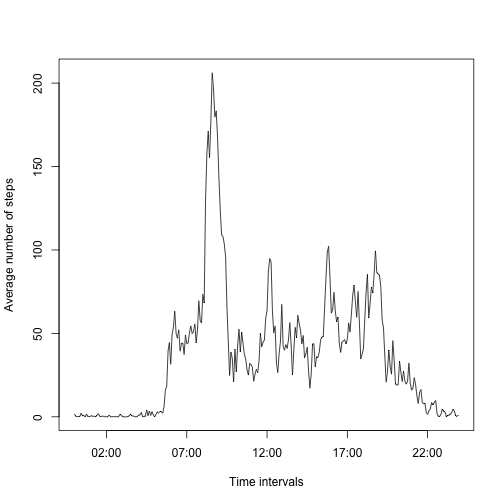

This is a R Markdown document created to satisfy the requirements of *Peer Assessment 1* of **Reproducible Research** Course.

##### Loading and preprocessing the data

```r
library(plyr)
actdata <- read.csv("./activity.csv",header = TRUE,stringsAsFactors = FALSE)
#actdata_NAremoved <- na.omit(actdata)
```

##### Below step calculates the total number of steps taken per day

```r
stepsum <- ddply(actdata,c("date"),summarise, TotalSteps = sum(steps,na.rm = TRUE))
```

##### Histogram of the total number of steps taken each day

```r
par(mfrow = c(1,1))
hist(stepsum$TotalSteps,col = "red",main = "Total Number of Steps",xlab = "Total Number of Steps")
```

 

##### Mean of the total number of steps taken per day

```r
mean1 <- mean(stepsum$TotalSteps,na.rm = TRUE)
paste("The mean is", round(mean1, 2))
```

```
## [1] "The mean is 9354.23"
```

##### Median of the total number of steps taken per day

```r
median1 <- median(stepsum$TotalSteps,na.rm = TRUE)
paste("The median is", round(median1, 2))
```

```
## [1] "The median is 10395"
```

##### Average daily activity pattern

```r
avgactivity <- ddply(actdata,c("interval"),summarise, avgsteps = mean(steps,na.rm = TRUE))
avgactivity$interval <- formatC((avgactivity$interval/100), digits =2 ,decimal.mark = ":",format = "f")
avgactivity$interval <- strptime(avgactivity$interval , "%H:%M")
```
##### Time series plot of the average number of steps taken (averaged across all days) versus the 5-minute intervals

```r
par(mfrow = c(1,1))
 plot(avgactivity$interval,avgactivity$avgsteps,pch = 20,type ="l",xlab = "Time intervals",ylab ="Average number of steps")
```

 

##### The 5-minute interval that contains the maximum number of steps

```r
avgactivity$interval <- sub(".* ", "", avgactivity$interval)
avgactivity[avgactivity$avgsteps == max(avgactivity$avgsteps),]
```

```
##     interval avgsteps
## 104 08:35:00 206.1698
```
##### Total number of missing values in the dataset

```r
sum(is.na(actdata$steps))
```

```
## [1] 2304
```
##### Create a new dataset that is equal to the original dataset but with the missing data filled in

```r
newactdata <- actdata
meandata <- ddply(newactdata,c("interval"),summarise, avgsteps = mean(steps,na.rm = TRUE))
actdataWithMeans <- merge(newactdata,meandata,by.x = "interval",by.y = "interval")
actdataWithMeans[is.na(actdataWithMeans$steps), ]$steps <- actdataWithMeans[is.na(actdataWithMeans$steps), ]$avgsteps
newstepsum <- ddply(actdataWithMeans,c("date"),summarise, TotalSteps = sum(steps))
```

##### Histogram of the total number of steps taken each day after imputing missing values

```r
par(mfrow = c(1,1))
hist(newstepsum$TotalSteps,col = "red",main = "Total Number of Steps",xlab = "Total Number of Steps")
```

 

##### Mean of the total number of steps taken per day after imputing missing values

```r
mean2 <- mean(newstepsum$TotalSteps)
paste("Mean after imputing NAs is ", round(mean2, 2))
```

```
## [1] "Mean after imputing NAs is  10766.19"
```

```r
paste("And the difference between means is  ", round(mean2, 2)-round(mean1, 2))
```

```
## [1] "And the difference between means is   1411.96"
```

##### Median of the total number of steps taken per day after imputing missing values

```r
median2 <- median(newstepsum$TotalSteps)
paste("Median after imputing NAs is ", round(median2, 2))
```

```
## [1] "Median after imputing NAs is  10766.19"
```

```r
paste("And the difference between medians is  ", round(round(median2, 2)-round(median1, 2)))
```

```
## [1] "And the difference between medians is   371"
```
##### Differences in activity patterns between weekdays and weekends. Processing the 'weekday' and 'weekend' data.

```r
library(lubridate)
```


```r
actdataWithMeans$date <- ymd(actdataWithMeans$date)
actdataWithMeans <- mutate(actdataWithMeans,IsWeekDay = as.factor(ifelse(wday(actdataWithMeans$date) %in% c(1,7), "Weekday", "Weekend")))
actdata_weekday <- actdataWithMeans[actdataWithMeans$IsWeekDay == "Weekday",]
actdata_weekend <- actdataWithMeans[actdataWithMeans$IsWeekDay == "Weekend",]
avgactivity_weekday <- ddply(actdata_weekday,c("interval"),summarise, avgsteps = mean(steps,na.rm = TRUE))
avgactivity_weekend <- ddply(actdata_weekend,c("interval"),summarise, avgsteps = mean(steps,na.rm = TRUE))
```

##### Panel plot containing a time series plot of the 5-minute interval (x-axis) and the average number of steps taken, averaged across all weekday days or weekend days (y-axis)

```r
par(mfrow = c(1,2))
plot(avgactivity_weekday$interval,avgactivity_weekday$avgsteps,pch = 20,type ="l",main = "Weekday",xlab = "Time interval",ylab ="Average number of steps",ylim = c(0,250))
plot(avgactivity_weekend$interval,avgactivity_weekend$avgsteps,pch = 20,type ="l",main = "Weekend",xlab = "Time interval",ylab ="Average number of steps",ylim = c(0,250))
```

 
